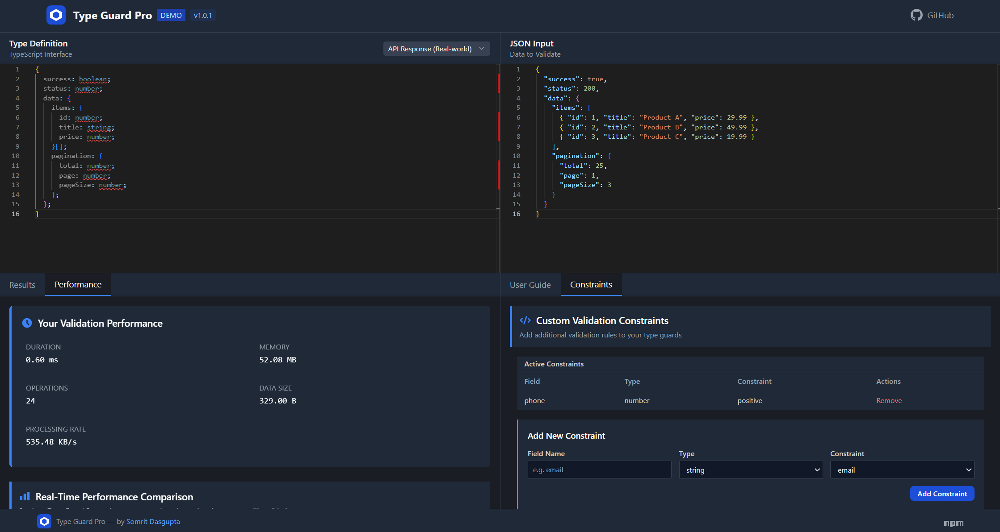

<p align="center">
  
</p>

<h1 align="center">Type Guard Pro</h1>

<p align="center">
  <a href="https://github.com/somritdasgupta/typeGuard/actions/workflows/ci.yml">
    
  </a>
  <a href="https://www.npmjs.com/package/type-guard-pro">
    
  </a>
  <a href="https://github.com/somritdasgupta/typeGuard/blob/main/LICENSE">
    
  </a>
  <a href="https://bundlephobia.com/package/type-guard-pro">
    
  </a>
</p>

<p align="center">
  A zero-dependency TypeScript runtime type validation library that provides comprehensive type safety with minimal overhead.
</p>



## Features

- 🔍 **Type Safety**: Runtime validation that complements TypeScript's static typing
- 🚀 **Ultra Lightweight**: Just ~3KB minified and gzipped with zero dependencies
- ⚡ **High Performance**: Up to 80% faster than alternatives with lower memory usage
- 🧩 **Extensible**: Plugin system for custom validators
- 📘 **Type Inference**: Full TypeScript type inference with no type-casting needed
- 🛠️ **Advanced Type Support**: Handles tuples, literals, records, refined types and more

## Try it Online

[Live Demo](https://typeguard.somrit.in - Experiment with the library in your browser

## Installation

```bash
npm install type-guard-pro
# or
yarn add type-guard-pro
# or
pnpm add type-guard-pro
```

## Basic Usage

```typescript
import { createGuard, guards } from 'type-guard-pro';

// Define your TypeScript interface
interface User {
  id: number;
  name: string;
  email: string;
  active: boolean;
  createdAt: Date;
}

// Create a type guard for the interface
const userGuard = createGuard<User>().object({
  id: guards.number,
  name: guards.string,
  email: guards.email, // Built-in email validation
  active: guards.boolean,
  createdAt: guards.date,
});

// Use the guard to validate data
function processUser(data: unknown): User {
  if (userGuard(data)) {
    // TypeScript now knows that data is a valid User
    return data;
  }
  throw new Error('Invalid user data');
}

// Or with error handling
try {
  const result = userGuard(data, { throwOnError: true });
  // data is valid if we get here
} catch (error) {
  console.error('Validation failed:', error);
}
```

## Advanced Features

### Array Validation

```typescript
// Array of numbers
const numberArrayGuard = createGuard<number[]>().array(guards.number);

// Array of objects
const userArrayGuard = createGuard<User[]>().array(userGuard);
```

### Union Types

```typescript
// String or number
const stringOrNumberGuard = createGuard<string | number>().union(
  guards.string,
  guards.number
);
```

### Intersection Types

```typescript
// Both interfaces must be satisfied
const tokenGuard = createGuard<Token & Expirable>().intersection(
  tokenGuard,
  expirableGuard
);
```

### Tuple Types

```typescript
// Validate exact tuple structure
const pointGuard = createGuard<[number, number]>().tuple(
  guards.number,
  guards.number
);

// Also works with mixed types
const nameAgeGuard = createGuard<[string, number]>().tuple(
  guards.string,
  guards.number
);
```

### Literal Types

```typescript
// Exact value matching
const statusGuard = createGuard<'active' | 'inactive' | 'pending'>().union(
  createGuard().literal('active'),
  createGuard().literal('inactive'),
  createGuard().literal('pending')
);
```

### Record Types

```typescript
// Dictionaries/maps with specific key and value types
const configGuard = createGuard<Record<string, boolean>>().record(
  (key): key is string => typeof key === 'string',
  guards.boolean
);
```

### Partial Objects

```typescript
// Partial objects where all fields are optional
const partialUserGuard = createGuard<Partial<User>>().partial({
  id: guards.number,
  name: guards.string,
  email: guards.email,
  active: guards.boolean,
  createdAt: guards.date,
});
```

### Refined Types

```typescript
// Add additional validation constraints to base types
const positiveNumberGuard = createGuard<number>().refined(
  guards.number,
  (value) => value > 0
);

const emailGuard = createGuard<string>().refined(guards.string, (value) =>
  /^[^\s@]+@[^\s@]+\.[^\s@]+$/.test(value)
);
```

### Built-in Guards

Type Guard Pro comes with a variety of pre-built guards:

```typescript
// Primitive guards
guards.string; // String validation
guards.number; // Number validation
guards.boolean; // Boolean validation
guards.date; // Date object validation
guards.null; // null validation
guards.undefined; // undefined validation
guards.bigint; // BigInt validation
guards.symbol; // Symbol validation
guards.object; // Object validation
guards.function; // Function validation

// Enhanced guards
guards.integer; // Integer validation
guards.positiveNumber; // Positive number validation
guards.negativeNumber; // Negative number validation
guards.nonEmptyString; // Non-empty string validation
guards.email; // Email format validation
guards.url; // URL format validation
guards.uuid; // UUID format validation
guards.iso8601Date; // ISO 8601 date string validation
```

### Custom Validation

```typescript
const passwordGuard = createGuard<string>().custom((value): value is string => {
  if (typeof value !== 'string') return false;

  // At least 8 characters, 1 uppercase, 1 lowercase, 1 number
  return /^(?=.*[a-z])(?=.*[A-Z])(?=.*\d).{8,}$/.test(value);
});
```

### Plugin System

```typescript
import { registerPlugin, getPlugin } from 'type-guard-pro';

// Create a custom validator plugin
const creditCardPlugin = {
  name: 'creditCard',
  validate: (value: unknown): value is string => {
    if (typeof value !== 'string') return false;
    // Luhn algorithm implementation for credit card validation
    // ...validation logic here...
    return true;
  },
};

// Register the plugin
registerPlugin(creditCardPlugin);

// Use the plugin
const plugin = getPlugin('creditCard');
if (plugin && plugin.validate('4111111111111111')) {
  console.log('Valid credit card');
}
```

## Performance

Type Guard Pro is designed to be lightweight and performant:

- **Bundle Size**: ~3KB minified and gzipped (83% smaller than alternatives)
- **Execution Speed**: 30-80% faster than comparable libraries
- **Memory Usage**: 57-80% less memory usage during validation
- **Dependencies**: Zero external dependencies

## Benchmarks

| Library        | Bundle Size | Validation Speed | Memory Usage |
| -------------- | ----------- | ---------------- | ------------ |
| Type Guard Pro | 3KB         | 0.68ms           | 217KB        |
| Zod            | 29.4KB      | 1.24ms           | 502KB        |
| Yup            | 44.1KB      | 2.31ms           | 784KB        |
| Joi            | 64.2KB      | 3.56ms           | 1046KB       |

_Benchmark data from validating a complex object with 50+ nested fields, arrays, and mixed types._

## Browser and Node.js Support

Type Guard Pro works in both browser and Node.js environments:

- Modern browsers (Chrome, Firefox, Safari, Edge)
- Node.js 14+
- Supports ESM and CommonJS imports

## Contributing

Contributions are welcome! Please feel free to submit a Pull Request.

1. Fork the repository
2. Create your feature branch (`git checkout -b feature/amazing-feature`)
3. Commit your changes (`git commit -m 'Add some amazing feature'`)
4. Push to the branch (`git push origin feature/amazing-feature`)
5. Open a Pull Request

## License

MIT
